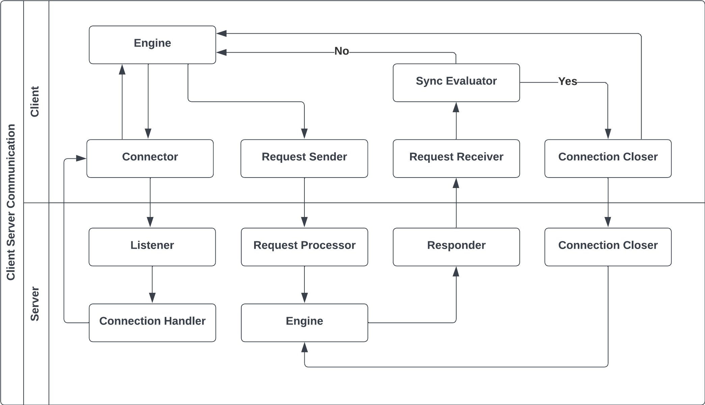
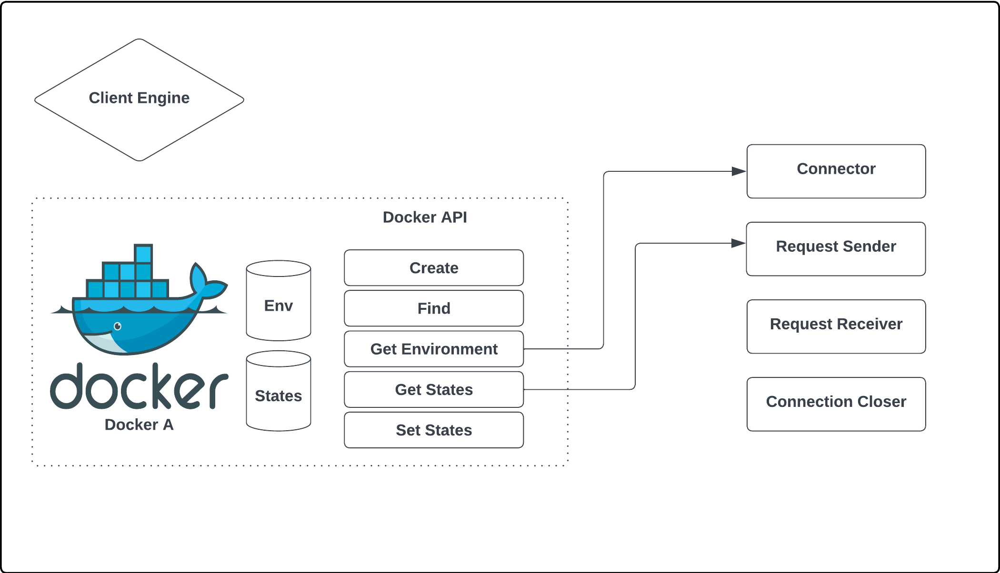
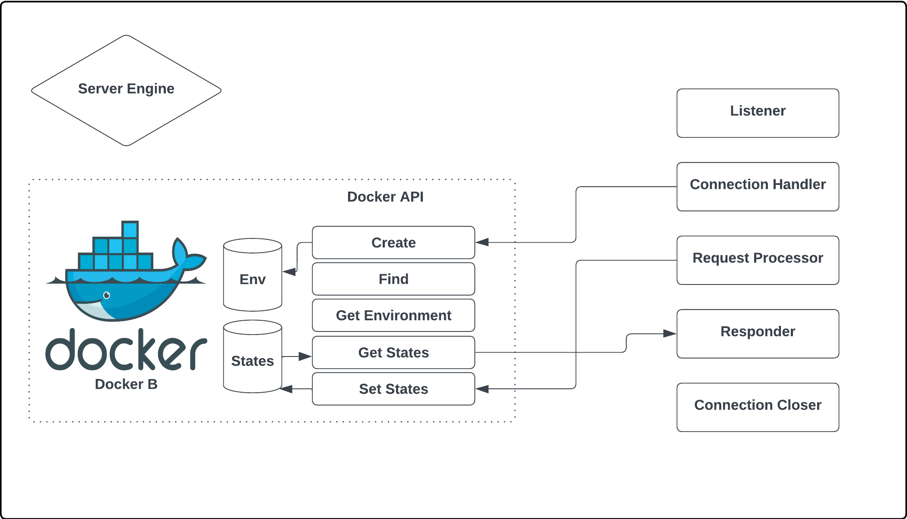

# Live Container Migration

## Overview

Live Container Migration is a project focused on enabling the seamless transfer of a running Docker container from one host to another without service disruption. This process ensures continuous application availability, preserving the container's state, including in-memory data and network connections. Unlike traditional non-live migration methods that may involve downtime, live migration maintains the operation of applications, making it a critical feature for dynamic resource allocation, load balancing, and application scalability.

## Significance

Container migration, particularly live migration, is significant due to its ability to ensure optimal resource utilization and enhance application scalability without disrupting service. Compared to VM migration, container migration is less explored, making this project pivotal in advancing the technology and providing a robust solution for live container migration.

## Challenge

The primary challenge of live container migration lies in its efficiency and transparency. Achieving a seamless migration process that remains unnoticed by users requires overcoming synchronization issues and minimizing latency. This project aims to tackle these challenges by adopting an iterative migration strategy inspired by VM migration techniques.

## Methodology

Our approach to live container migration involves several stages of pre-dumping and synchronization between the source and target containers. Utilizing Docker's experimental feature for Checkpoint and Restore, based on CRIU, we plan to enhance this process for live migration. The project will leverage Docker APIs for its implementation, allowing for greater flexibility and customization in designing migration strategies.

## Flowchart

## Client Engine

## Server Engine

## Project Plan

### Milestones

- **Milestone One:** Implement live container migration without I/O events.
- **Milestone Two:** Add support for filesystem and network I/O in the migration process.
- **Milestone Three:** Enable cross-instance live migration, potentially utilizing cloud services like AWS.

## Environment Requirement

The project requires a Linux (Ubuntu) environment with Docker for container creation and management. The development will primarily be in Go, utilizing the Docker APIs.

## License

This project is licensed under the MIT License - see the [LICENSE](LICENSE) file for details.

